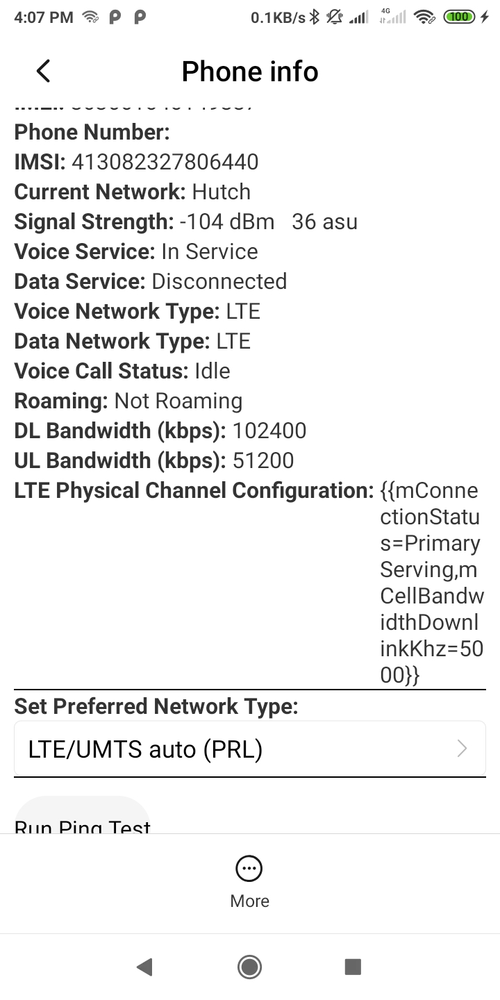

# **4G LTE Only Mode App** 🚀

Welcome to the **4G LTE Only Mode App**, your ultimate solution to lock your Android device to 4G LTE for faster, more stable internet connectivity. Avoid interruptions caused by automatic network switching and enjoy high-speed internet for gaming, streaming, and browsing!

---

## **Badges**

https://PlayBadges.pavi2410.me/badge/downloads?id=<com.kiloo.subwaysurf>[&pretty]

---

## **Features**

- **4G LTE Lock**  
  Lock your device to 4G LTE and prevent automatic switching to slower networks like 3G or 2G.

- **User-Friendly Interface**  
  A clean and intuitive design for effortless use.

- **Network Speed Optimization**  
  Experience faster and more stable internet connections.

---

## **App Screenshots** 📱

Here’s a sneak peek of the app:

| Screenshot 1                          | Screenshot 2                          | Screenshot 3                          | Screenshot 4                          |  
|---------------------------------------|---------------------------------------|---------------------------------------|---------------------------------------|  
|  |  |  |  |  

---

## **How It Works**

1. Launch the app and grant necessary permissions.
2. Lock your device to 4G LTE mode with a single tap.
3. Monitor your signal strength for the best connection.
4. Enjoy seamless internet connectivity without interruptions.

---

## **Technical Information**

- **Platform:** Android
- **Language:** Java/Kotlin
- **Requirements:** Android 5.0 (Lollipop) and above
- **Permissions Required:** Do not required any permissions

---

## **Privacy and Data Usage**

This app does not collect, store, or share any personal data. It only accesses necessary system settings to provide its functionality.

---

## **Installation**

To use this app:

1. Clone or download the repository.
2. Open the project in Android Studio.
3. Build and install the app on your Android device.
4. Lock your network to 4G LTE and enjoy!

---

## **Future Plans**

Our roadmap includes:
- Support for 5G network locking.
- Improved signal strength analysis and recommendations.
- Additional language support for global users.

---

## **Contact Us**

For any issues, feedback, or suggestions, feel free to [open an issue](https://github.com/ishara-madu/Interactive-Quiz-App/issues) or reach out via email at [isharamadushankab@gmail.com].

---

## **Contributing**

We welcome contributions! Fork the repository, make your changes, and submit a pull request to help improve the app.

---

## **License**

This project is licensed under the MIT License - see the [LICENSE](LICENSE) file for details.

---

**Lock your network and enjoy blazing-fast internet with the 4G LTE Only Mode App!** 🚀
