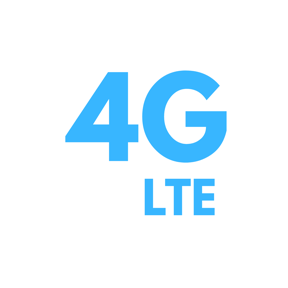

# Force LTE Only

<p align="center">
  
</p>

<p align="center">
  <strong>A powerful Android app to monitor, analyze, and optimize your LTE/5G connection</strong>
</p>

<p align="center">
  <a href="https://github.com/ishara-madu/4GLTEOnlyApp/releases">
    
  </a>
  <a href="https://github.com/ishara-madu/4GLTEOnlyApp/blob/main/LICENSE">
    
  </a>
  <a href="https://android.com">
    
  </a>
  
  
</p>

---

## Table of Contents

- [What's New](#whats-new)
- [Features](#features)
- [Screenshots](#screenshots)
- [Requirements](#requirements)
- [Installation](#installation)
- [Building from Source](#building-from-source)
- [Project Structure](#project-structure)
- [Architecture & Tech Stack](#architecture--tech-stack)
- [Permissions](#permissions)
- [How It Works](#how-it-works)
- [Contributing](#contributing)
- [License](#license)
- [Support](#support)

---

## What's New 🚀

- **Live Network Band Info:** Dynamically detects and displays the connected LTE/5G Band in real-time, handling required location permissions gracefully.
- **LTE Only PRO (Premium Tier):** Integrated **RevenueCat** for robust subscription management. Users can upgrade to an ad-free Pro tier to unlock advanced network tools like the Game Servers Ping Analyzer and historical analytics.
- **Google Play In-App Reviews:** Seamlessly integrates the native In-App Review API, intelligently and silently triggering after successful network switching flows without spamming the user.
- **Massive Performance Optimizations:** App size reduced by over **50%** for release builds using aggressive **R8 shrinking**, strict resource minification, unused dependency stripping, and comprehensive **WebP** asset conversion, all without compromising UI/UX!

---

## Features

### 📡 Network Monitoring
- **Real-time Signal Analysis** - Monitor RSRP, RSRQ, RSSI, and SINR signal metrics.
- **Carrier & Band Information** - View carrier name, network type, MCC/MNC codes, Cell ID, and live LTE/5G NR Band tracking.
- **Connection Status** - Live connection state and roaming detection.

### ⚡ Speed & Latency Testing
- **Speed Tests** - Measure your actual download and upload speeds.
- **Ping/Latency Test** - Check your network response time.
- **Gaming Ping Analyzer (PRO)** - Real-time regional server latency tests tailored for global gaming servers.

### 📊 Analytics
- **Signal History Chart** - Visualize signal strength changes over time.
- **Pro Analytics** - Review historical speed test results with clear, dynamic charts.
- **Data Usage Tracking** - Monitor mobile and Wi-Fi data consumption.

### 🎛️ Tools
- **4G LTE Switcher** - Quick access to force LTE network mode via hidden system settings (with fallback dialer intents).
- **APN Settings** - Direct link to configure your APN settings.
- **Background Monitoring** - Continuous signal monitoring while the app is running.

### 🎨 User Experience
- **100% Jetpack Compose** - Built entirely with modern declarative UI.
- **Neumorphic Design** - Beautiful, modern UI with soft shadows and depth.
- **Theme Engine** - Dynamically adapts to Light, Dark, and System themes.
- **Ad-Free Interface (PRO)** - Completely remove all banner, interstitial, and app-open ads.

---

## Screenshots

<p align="center">
  
  
  
</p>

<p align="center">
  
  
</p>

---

## Requirements

- **Android Version**: 7.0 Nougat (API 24) or higher
- **Device**: Any Android device with cellular capabilities
- **Permissions**: Location and Phone State access required for signal and band monitoring

---

## Installation

### From Google Play Store
[](https://play.google.com/store/apps/details?id=com.pixeleye.lteonly)

### From APK (Direct Download)
1. Download the latest APK from the [Releases](https://github.com/ishara-madu/4GLTEOnlyApp/releases) page
2. Enable "Install from unknown sources" in your device settings
3. Open the downloaded APK file
4. Tap Install

---

## Building from Source

### Prerequisites

Before building, ensure you have the following installed:
- **Android Studio** (Hedgehog or newer recommended)
- **JDK 11** or higher
- **Android SDK** with API Level 36
- **Gradle** (included in the project)

### Steps

1. **Clone the repository**
   ```bash
   git clone https://github.com/ishara-madu/4GLTEOnlyApp.git
   cd ForceLTEOnly
   ```

2. **Configure Security & Keys (local.properties)**
   Create a `local.properties` file in the root directory and add your API keys:
   ```properties
   REVENUECAT_API_KEY=your_revenuecat_key_here
   ADMOB_APP_ID=ca-app-pub-your_admob_app_id
   ADMOB_BANNER_ID=ca-app-pub-your_banner_id
   ADMOB_INTERSTITIAL_ID=ca-app-pub-your_interstitial_id
   ADMOB_APP_OPEN_ID=ca-app-pub-your_app_open_id
   ```

3. **Open in Android Studio**
   - Select "Open an existing project" and navigate to the cloned directory.
   - Wait for Gradle sync to complete.

4. **Build the Debug APK**
   ```bash
   ./gradlew assembleDebug
   ```

5. **Build the Release APK**
   ```bash
   ./gradlew assembleRelease
   ```
   *Note: Release builds are heavily optimized with R8. Ensure your keys are valid to prevent build failures.*

---

## Project Structure

```
ForceLTEOnly/
├── app/
│   ├── src/
│   │   └── main/
│   │       ├── java/com/pixeleye/lteonly/
│   │       │   ├── MainActivity.kt          # Main Compose entry point
│   │       │   ├── LteOnlyApplication.kt    # Application class (RevenueCat/AdMob Init)
│   │       │   ├── TelephonyService.kt      # Core signal & band monitoring
│   │       │   ├── RadioInfoHelper.kt       # Opens LTE settings
│   │       │   ├── PremiumUpgradeScreen.kt  # Custom RevenueCat Paywall UI
│   │       │   ├── ProStateManager.kt       # Global premium state flow
│   │       │   ├── AdManager.kt             # Strict AdMob implementation
│   │       │   ├── Room DB & Repositories   # Local Data Persistence
│   │       │   └── ui/
│   │       │       └── theme/               # Material 3 & Neumorphic styling
│   │       ├── res/                         # Compressed WebP Android resources
│   │       └── AndroidManifest.xml
│   ├── build.gradle.kts                     # App-level build logic
│   └── proguard-rules.pro                   # Custom R8 keep rules
├── gradle/                                  # Gradle wrapper
├── build.gradle.kts                         # Root build file
└── local.properties                         # Secret Keys (Git Ignored)
```

---

## Architecture & Tech Stack

The app follows a clean, modular architecture pattern strictly adhering to modern Android development practices.

```
┌─────────────────────────────────────────────────────────────┐
│                        UI Layer                              │
│  (100% Jetpack Compose - Reactive State Flows)               │
└─────────────────────────────────────────────────────────────┘
                               │
                               ▼
┌─────────────────────────────────────────────────────────────┐
│                      Domain Layer                            │
│  (TelephonyService, RadioInfoHelper, ProStateManager)        │
└─────────────────────────────────────────────────────────────┘
                               │
                               ▼
┌─────────────────────────────────────────────────────────────┐
│                       Data Layer                             │
│  (Room Database, RevenueCat SDK, AdMob SDK, Data Repos)      │
└─────────────────────────────────────────────────────────────┘
```

### Key Technologies Used

| Category | Technology |
|----------|------------|
| **Language** | Kotlin 1.9+ |
| **UI Framework** | **Jetpack Compose** (Material 3) |
| **Architecture** | MVVM + Clean Architecture |
| **Monetization** | **RevenueCat** (Purchases SDK) |
| **Ads** | Google AdMob |
| **Database** | Room Persistence Library |
| **Async** | Kotlin Coroutines & Flow |
| **Build System** | Gradle with Kotlin DSL |

---

## Permissions

The app requires the following permissions to function:

| Permission | Purpose |
|------------|---------|
| `READ_PHONE_STATE` | Access signal strength and network information |
| `ACCESS_FINE_LOCATION` | Required for accurate cell tower and **LTE Band** detection |
| `ACCESS_COARSE_LOCATION` | Fallback location access |
| `INTERNET` | Speed test functionality & API interactions |
| `POST_NOTIFICATIONS` | Speed test reminders (Android 13+) |

---

## How It Works

### Signal Monitoring
1. The app uses Android's `TelephonyManager` to access cellular information.
2. `CellInfoLte` and `CellInfoNr` provide detailed signal metrics and LTE bands.
3. Data is stored in a Room database for historical analysis.

### Network Mode Switching
1. The app provides a shortcut button to open system Radio Info menus.
2. From there, users can select their preferred network mode (LTE only, 5G preferred, etc.).
3. Note: Direct programmatic network mode changes are restricted by Android for security.

---

## Contributing

Contributions are welcome! Here's how you can help:

1. **Fork the Repository**
2. **Create a Feature Branch** (`git checkout -b feature/your-feature-name`)
3. **Commit Your Changes** (`git commit -m "Add: your feature description"`)
4. **Push and Create Pull Request**

### Reporting Issues
- Use GitHub Issues to report bugs
- Include your Android version and device model
- Provide steps to reproduce the issue

---

## License

This project is licensed under the **MIT License** - see the [LICENSE](LICENSE) file for details.

---

## Support

### Get Help
- 📖 Check the [Wiki](https://github.com/ishara-madu/4GLTEOnlyApp/wiki)
- 🐛 Report bugs via [Issues](https://github.com/ishara-madu/4GLTEOnlyApp/issues)

### Rate the App
If you find this app useful, please consider:
- ⭐ Starring the repository
- ⬇️ Rating on [Google Play Store](https://play.google.com/store/apps/details?id=com.pixeleye.lteonly)

---

## Acknowledgments
- Built with **Jetpack Compose**
- Monetization powered by **RevenueCat**
- Design inspired by modern neumorphic UI trends

---

<p align="center">
  Made with ❤️ by <a href="https://github.com/ishara-madu">Ishara Madhusanka</a>
</p>
