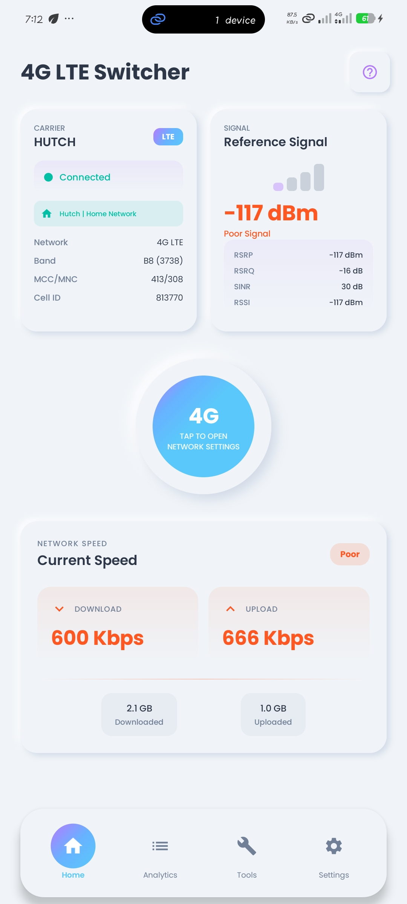
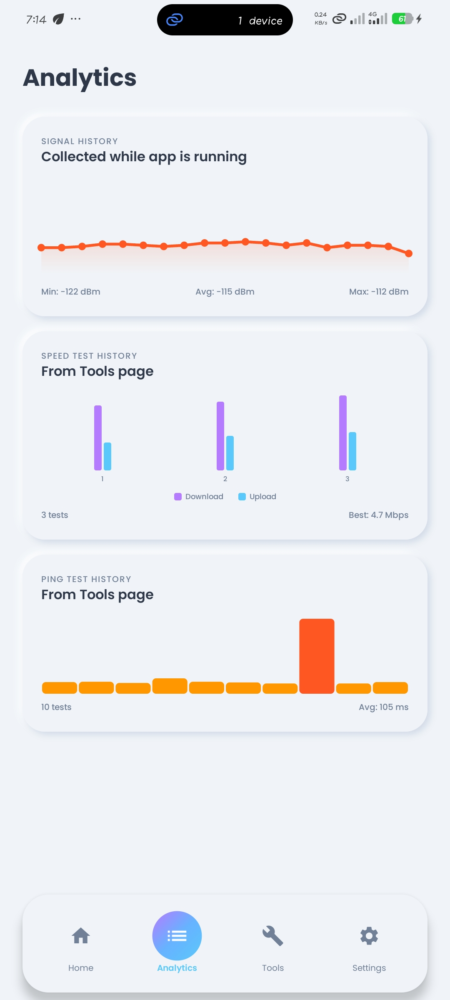
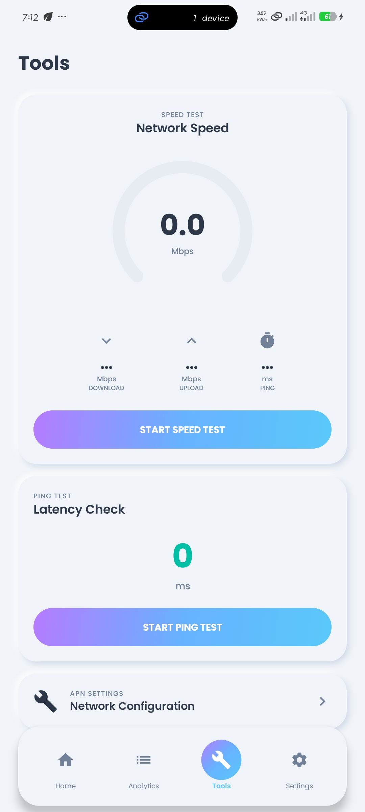
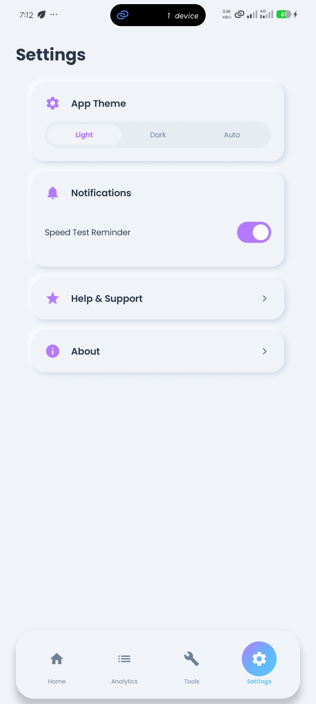
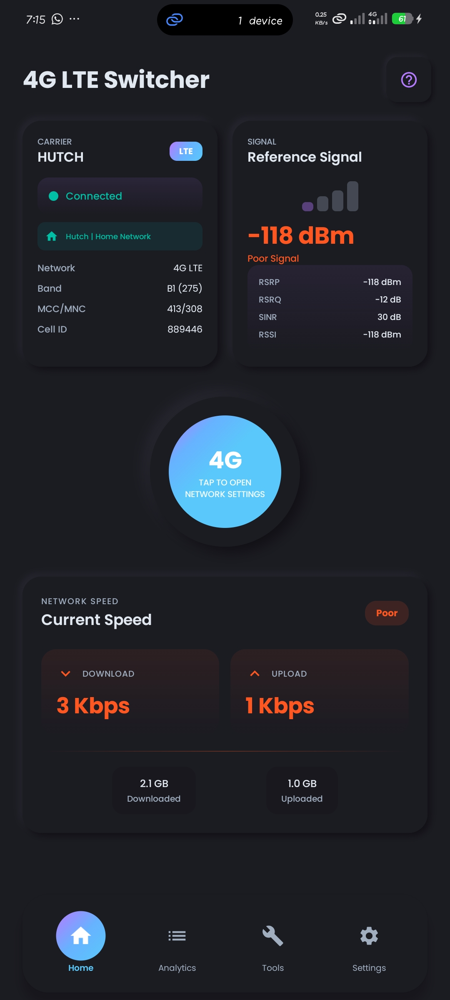

# Force LTE Only

<p align="center">
  
</p>

<p align="center">
  <strong>A powerful Android app to monitor, analyze, and optimize your LTE/5G connection</strong>
</p>

<p align="center">
  <a href="https://github.com/ishara-madu/4GLTEOnlyApp/releases">
    
  </a>
  <a href="https://github.com/ishara-madu/4GLTEOnlyApp/blob/main/LICENSE">
    
  </a>
  <a href="https://android.com">
    
  </a>
  
  
</p>

---

## Table of Contents

- [Features](#features)
- [Screenshots](#screenshots)
- [Requirements](#requirements)
- [Installation](#installation)
- [Building from Source](#building-from-source)
- [Project Structure](#project-structure)
- [Architecture](#architecture)
- [Technologies Used](#technologies-used)
- [Permissions](#permissions)
- [How It Works](#how-it-works)
- [Contributing](#contributing)
- [License](#license)
- [Support](#support)

---

## Features

### 📡 Network Monitoring
- **Real-time Signal Analysis** - Monitor RSRP, RSRQ, RSSI, and SINR signal metrics
- **Carrier Information** - View carrier name, network type, MCC/MNC codes, and Cell ID
- **Band Detection** - Automatically detect LTE and 5G NR bands
- **Connection Status** - Live connection state and roaming detection

### ⚡ Speed Testing
- **Download Speed Test** - Measure your actual download speeds
- **Upload Speed Test** - Measure your upload performance
- **Ping/Latency Test** - Check your network response time
- **Speed History** - Track and analyze your speed test results over time

### 📊 Analytics
- **Signal History Chart** - Visualize signal strength changes over time
- **Speed Test History** - Review past speed test results with charts
- **Ping History** - Track latency trends and identify network issues
- **Data Usage Tracking** - Monitor mobile and Wi-Fi data consumption

### 🎛️ Tools
- **4G LTE Switcher** - Quick access to force LTE network mode via system settings
- **APN Settings** - Direct link to configure your APN settings
- **Background Monitoring** - Continuous signal monitoring while app is running

### 🎨 User Experience
- **Neumorphic Design** - Beautiful, modern UI with soft shadows and depth
- **Dark/Light/Auto Theme** - Choose your preferred appearance
- **Smooth Animations** - Fluid transitions and micro-interactions
- **Intuitive Navigation** - Bottom navigation with 4 main sections

---

## Screenshots

<p align="center">
  
  
  
</p>

<p align="center">
  
  
</p>

---

## Requirements

- **Android Version**: 7.0 Nougat (API 24) or higher
- **Device**: Any Android device with cellular capabilities
- **Permissions**: Location and Phone State access required for signal monitoring

---

## Installation

### From Google Play Store
[](https://play.google.com/store/apps/details?id=com.pixeleye.lteonly)

### From APK (Direct Download)
1. Download the latest APK from the [Releases](https://github.com/ishara-madu/4GLTEOnlyApp/releases) page
2. Enable "Install from unknown sources" in your device settings
3. Open the downloaded APK file
4. Tap Install

---

## Building from Source

### Prerequisites

Before building, ensure you have the following installed:
- **Android Studio** (Hedgehog or newer recommended)
- **JDK 11** or higher
- **Android SDK** with API Level 36
- **Gradle** (included in the project)

### Steps

1. **Clone the repository**
   ```bash
   git clone https://github.com/ishara-madu/4GLTEOnlyApp.git
   cd ForceLTEOnly
   ```

2. **Open in Android Studio**
   - Launch Android Studio
   - Select "Open an existing project"
   - Navigate to the cloned directory
   - Wait for Gradle sync to complete

3. **Configure Firebase/AdMob (Optional)**
   - If you want to use AdMob:
     - Create a Firebase project at [Firebase Console](https://console.firebase.google.com)
     - Add your Android app with the package name `com.pixeleye.lteonly`
     - Download `google-services.json` and place it in the `app/` directory
   - For testing without ads, the app uses test ad units by default

4. **Build the Debug APK**
   ```bash
   ./gradlew assembleDebug
   ```

5. **Build the Release APK**
   ```bash
   ./gradlew assembleRelease
   ```
   - Configure signing in `gradle.properties` or use Android Studio's signing config

6. **Find the APK**
   - Debug APK: `app/release/app-debug.apk`
   - Release APK: `app/release/app-release.apk`

---

## Project Structure

```
ForceLTEOnly/
├── app/
│   ├── src/
│   │   └── main/
│   │       ├── java/com/pixeleye/lteonly/
│   │       │   ├── MainActivity.kt          # Main entry point
│   │       │   ├── LteOnlyApp.kt             # Application class
│   │       │   ├── TelephonyService.kt       # Core signal monitoring
│   │       │   ├── RadioInfoHelper.kt       # Opens LTE settings
│   │       │   ├── NetworkInfo.kt            # Data models
│   │       │   ├── AppDatabase.kt            # Room database
│   │       │   ├── AppRepository.kt          # Data repository
│   │       │   ├── SettingsManager.kt        # User preferences
│   │       │   ├── ThemeManager.kt           # Theme handling
│   │       │   ├── NotificationHelper.kt    # Notifications
│   │       │   ├── SpeedTestReminderWorker.kt# Background worker
│   │       │   ├── AdManager.kt              # AdMob integration
│   │       │   ├── AdComposables.kt          # Ad UI components
│   │       │   ├── SpeedTestDao.kt           # Speed test database
│   │       │   ├── PingTestDao.kt            # Ping test database
│   │       │   ├── DataUsageDao.kt           # Data usage database
│   │       │   ├── SignalHistoryDao.kt       # Signal history database
│   │       │   ├── *Entity.kt                # Database entities
│   │       │   └── ui/
│   │       │       ├── theme/               # Compose theming
│   │       │       │   ├── Color.kt
│   │       │       │   ├── Type.kt
│   │       │       │   ├── Theme.kt
│   │       │       │   └── Neumorphic.kt    # Custom neumorphic styles
│   │       │       └── (UI components in MainActivity.kt)
│   │       ├── res/                          # Android resources
│   │       └── AndroidManifest.xml
│   ├── build.gradle.kts
│   └── proguard-rules.pro
├── gradle/                                    # Gradle wrapper
├── build.gradle.kts                           # Root build file
├── settings.gradle.kts
├── gradle.properties
└── README.md
```

---

## Architecture

The app follows a clean, modular architecture pattern:

```
┌─────────────────────────────────────────────────────────────┐
│                        UI Layer                              │
│  (Jetpack Compose - MainActivity, Composable functions)      │
└─────────────────────────────────────────────────────────────┘
                              │
                              ▼
┌─────────────────────────────────────────────────────────────┐
│                      Domain Layer                            │
│  (TelephonyService, RadioInfoHelper, NetworkInfo)            │
└─────────────────────────────────────────────────────────────┘
                              │
                              ▼
┌─────────────────────────────────────────────────────────────┐
│                       Data Layer                             │
│  (Room Database, SharedPreferences, Repositories)            │
└─────────────────────────────────────────────────────────────┘
```

### Key Components

- **TelephonyService** - Handles all telephony and signal-related operations
- **AppRepository** - Manages data flow between UI and database
- **Room Database** - Stores signal history, speed tests, ping tests, and data usage
- **WorkManager** - Handles periodic speed test reminders
- **ThemeManager** - Manages app theming (Light/Dark/System)

---

## Technologies Used

| Category | Technology |
|----------|------------|
| **Language** | Kotlin 1.9+ |
| **UI Framework** | Jetpack Compose (Material 3) |
| **Architecture** | MVVM + Clean Architecture |
| **DI** | Manual dependency injection |
| **Database** | Room Persistence Library |
| **Background Tasks** | WorkManager |
| **Ads** | Google AdMob |
| **Async** | Kotlin Coroutines & Flow |
| **Build System** | Gradle with Kotlin DSL |

### Key Dependencies

- `androidx.compose.ui` - Compose UI toolkit
- `androidx.compose.material3` - Material Design 3 components
- `androidx.room` - Local database
- `androidx.work` - Background processing
- `play-services-ads` - AdMob integration
- `androidx.lifecycle` - ViewModel and lifecycle-aware components

---

## Permissions

The app requires the following permissions to function:

| Permission | Purpose |
|------------|---------|
| `READ_PHONE_STATE` | Access signal strength and network information |
| `ACCESS_FINE_LOCATION` | Required for accurate cell tower detection |
| `ACCESS_COARSE_LOCATION` | Fallback location access |
| `INTERNET` | Speed test functionality |
| `POST_NOTIFICATIONS` | Speed test reminders (Android 13+) |

### Why These Permissions?

- **Phone State** - To read RSRP, RSRQ, RSSI, and other signal metrics from the cellular radio
- **Location** - Android requires location permission to access detailed cell information (this is a system requirement for signal monitoring on modern Android versions)
- **Internet** - Speed tests download and upload data to measure connection quality
- **Notifications** - To send reminders for periodic speed tests

---

## How It Works

### Signal Monitoring
1. The app uses Android's `TelephonyManager` to access cellular information
2. `CellInfoLte` and `CellInfoNr` provide detailed signal metrics
3. Signal data is sampled every 2 seconds while the app is running
4. Data is stored in Room database for historical analysis

### Network Mode Switching
1. The app provides a shortcut button to open system Radio Info menus
2. These menus are manufacturer-specific system settings
3. From there, users can select their preferred network mode (LTE only, 5G preferred, etc.)
4. Note: Direct programmatic network mode changes are restricted by Android for security

### Speed Testing
1. Downloads 5MB from Cloudflare's speed test endpoint
2. Uploads 5MB to the same endpoint
3. Measures ping latency using system ping command
4. Results are stored and displayed in the Analytics tab

---

## Contributing

Contributions are welcome! Here's how you can help:

1. **Fork the Repository**
   ```bash
   git fork https://github.com/ishara-madu/4GLTEOnlyApp
   ```

2. **Create a Feature Branch**
   ```bash
   git checkout -b feature/your-feature-name
   ```

3. **Make Your Changes**
   - Follow the existing code style
   - Add comments for complex logic
   - Update documentation as needed

4. **Commit Your Changes**
   ```bash
   git commit -m "Add: your feature description"
   ```

5. **Push and Create Pull Request**
   ```bash
   git push origin feature/your-feature-name
   ```

### Reporting Issues

- Use GitHub Issues to report bugs
- Include your Android version and device model
- Provide steps to reproduce the issue
- Attach logs if applicable

---

## License

This project is licensed under the **MIT License** - see the [LICENSE](LICENSE) file for details.

```
MIT License

Copyright (c) 2024 PixelEye

Permission is hereby granted, free of charge, to any person obtaining a copy
of this software and associated documentation files (the "Software"), to deal
in the Software without restriction, including without limitation the rights
to use, copy, modify, merge, publish, distribute, sublicense, and/or sell
copies of the Software, and to permit persons to whom the Software is
furnished to do so, subject to the following conditions:

The above copyright notice and this permission notice shall be included in all
copies or substantial portions of the Software.

THE SOFTWARE IS PROVIDED "AS IS", WITHOUT WARRANTY OF ANY KIND, EXPRESS OR
IMPLIED, INCLUDING BUT NOT LIMITED TO THE WARRANTIES OF MERCHANTABILITY,
FITNESS FOR A PARTICULAR PURPOSE AND NONINFRINGEMENT. IN NO EVENT SHALL THE
AUTHORS OR COPYRIGHT HOLDERS BE LIABLE FOR ANY CLAIM, DAMAGES OR OTHER
LIABILITY, WHETHER IN AN ACTION OF CONTRACT, TORT OR OTHERWISE, ARISING FROM,
OUT OF OR IN CONNECTION WITH THE SOFTWARE OR THE USE OR OTHER DEALINGS IN THE
SOFTWARE.
```

---

## Support

### Get Help
- 📖 Check the [Wiki](https://github.com/ishara-madu/4GLTEOnlyApp/wiki)
- 💬 Join our [Discussions](https://github.com/ishara-madu/4GLTEOnlyApp/discussions)
- 🐛 Report bugs via [Issues](https://github.com/ishara-madu/4GLTEOnlyApp/issues)

### Rate the App
If you find this app useful, please consider:
- ⭐ Starring the repository
- ⬇️ Rating on [Google Play Store](https://play.google.com/store/apps/details?id=com.pixeleye.lteonly)
- 🐦 Sharing with friends

### Donate
If you'd like to support development:
- ☕ Buy me a coffee
- 💝 Become a sponsor

---

## Acknowledgments

- Design inspired by modern neumorphic UI trends
- Speed test powered by [Cloudflare](https://cloudflare.com)
- Built with [Jetpack Compose](https://developer.android.com/compose)
- Icons from [Material Design Icons](https://fonts.google.com/icons)

---

<p align="center">
  Made with ❤️ by <a href="https://github.com/ishara-madu">Ishara Madhusanka</a>
</p>

<p align="center">
  <a href="https://github.com/ishara-madu/4GLTEOnlyApp">Repository</a> •
  <a href="https://github.com/ishara-madu/4GLTEOnlyApp/releases">Releases</a> •
  <a href="https://github.com/ishara-madu/4GLTEOnlyApp/issues">Issues</a>
</p>
